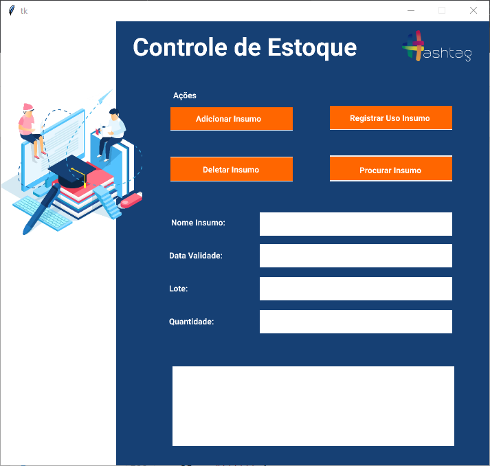

# Sistema de Controle de Estoque

## Contexto

Este projeto é um sistema de controle de estoque que permite a execução
de operações do tipo CRUD (Create, Read, Update e Delete) em um banco de
dados relacional.

O banco de dados do referido sistema contém uma única tabela chamada
__Insumos__, a qual possui as seguintes colunas:

- id_insumo
- nome_insumo
- data_validade
- lote
- qtde

## Divisão do Problema

### Criar Insumo

Para executar esta funcionalidade, o usuário clica no botão __Adicionar Insumo__,
o qual realiza as seguintes tarefas:

1. Obter as informações de todos os campos;
2. Criar no banco de dados um novo registro;
3. Exibir uma mensagem para o usuário informando que um novo insumo foi inserido.

### Ler Insumo

Para executar esta funcionalidade, o usuário clica no botão __Procurar Insumo__,
o qual realiza as seguintes tarefas:

1. Obter nome do insumo no campo `entry1`;
2. Consultar informações do insumo no banco de dados;
3. Exibir os resultados da consulta para o usuário no campo `entry0`.

### Atualizar Insumo

Para executar esta funcionalidade, o usuário clica no botão __Consumir Insumo__,
o qual realiza as seguintes tarefas:

1. Obter as informações preenchidas nos campos de nome e de quantidade;
2. Consultar o banco de dados e atualizar a quantidade disponível;
3. Exibir mensagem para o usuário indicando que um insumo foi consumido.

### Remover Insumo

Para executar esta funcionalidade, o usuário clica no botão __Deletar Insumo__,
o qual realiza as seguintes tarefas:

1. Obter o nome do insumo;
2. Consultar o banco de dados para remover o insumo;
3. Exibir mensagem para o usuário de que um insumo foi removido.

## Bibliotecas

Neste projeto são usadas as seguintes bibliotecas/módulos:

- tkinter
- pyodbc

## Tela do Sistema

Na imagem a seguir, temos uma captura da tela do sistema:

